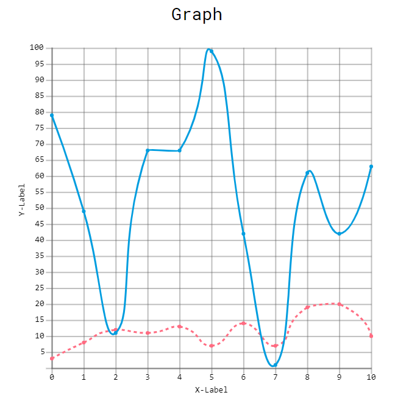
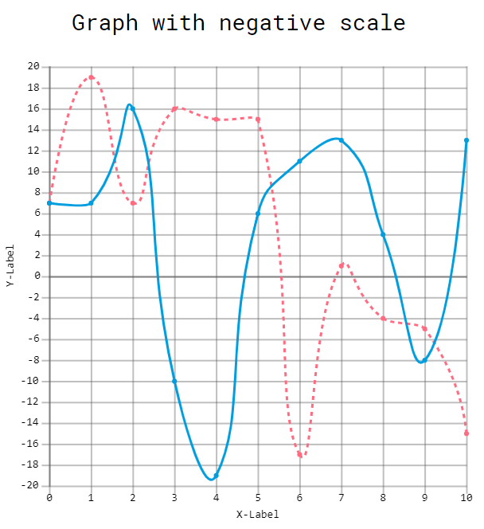

<h1 align='center'>graph.js :chart_with_upwards_trend: :bar_chart: </h1>
A fast and robust library to draw graphs and charts in the browser. The current version supports drawing graphs with positive and negative scales. It also enables the user to add custom labels and tittles to the graphs.

## Getiting started 

To create a new graph you must import the minified or combined version into the html document by adding this line in the `` <body>`` or ``<head>`` tag. Insert this script tag into the html document:
``` html

<script src="js/graph-js/dist/graph.min.js">
```
Once you have done this, to create a new graph you must initialise a graph object by providing it a ``<div>`` element id, where the graph object should insert the given tittle and canvas (if no canvas exists within the element). To this, simply create a new variable and associate a 'new' graph object like so:
```html
 <div id="graph">
        <div class="tittle"></div>
        <canvas width="800" height="600"></canvas>
    </div>
```

```javascript

// where elementId is the given id of the div you wish for the graph to use

let graph = new Graph("elementId", {
  tittle: "A new graph!",
  x_label: "X-Axis",
  y_label: "Y-Axis"
});

// let's draw the graph
graph.draw();
```

Creating a simple graph with some data sets:

```javascript
 let graph = new Graph('g', {
            x_label: 'X-Label',
            y_label: 'Y-Label',
            tittle_pos: 'top-center',
            gridded: true
        },
        [
            {
                style: "dashed",
                label: 'student_1',
                interpolation: 'cubic',
                data: getRandomArray(11, 0, 20),
                colour: Graph.Colours.FLAMINGO_PINK
            },
            {
                label: 'student_1',
                interpolation: 'cubic',
                data: getRandomArray(11, 0, 100),
                colour: Graph.Colours.ELECTRIC_BLUE
            }
        ]
    );
    graph.draw();
```

Result:




The library also supports data sets which include negative numbers:

```javascript
let graph = new Graph('graph', {
            x_label: 'X-Label',
            y_label: 'Y-Label',
            tittle_pos: 'top-center',
            gridded: true
        },
        [
            {
                style: "dashed",
                label: 'student_1',
                interpolation: 'cubic',
                data: getRandomArray(11, -20, 20),
                colour: Graph.Colours.FLAMINGO_PINK
            },
            {
                label: 'student_1',
                interpolation: 'cubic',
                data: getRandomArray(11, -20, 20),
                colour: Graph.Colours.ELECTRIC_BLUE
            }
        ]
    );
    graph.draw();
```

Result:


