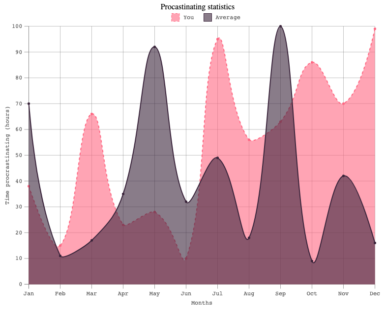

# Configuring the Graph legend

When creating a new graph, you can customise the look and feel of the legend component of a graph.

## Sample

From this sample, it's easy to see how someone could configure the legend options for some graph:

```javascript
 let graph = new Graph('g', {
            ...
            // generic legend options
            legend: {
                draw: true,
                position: "top",
                alignment: "center"
                ...
            },
            ...
        },
        [ ... ]
}

```

## Options

Here's a table of all the options that are provided for legends, what they mean and what are the defaults:

| Name      | Type                       | Default  | Description                                                              |
|-----------|----------------------------|----------|--------------------------------------------------------------------------|
| draw      | `boolean`                  | `false`  | Whether or not to draw a legend for the current graph.                   |
| position  | `top\|right\|bottom\|left` | `top`    | The position of the legend component.                                    |
| alignment | `start\|center\|end`       | `center` | The alignment of the legend container within the current position space. |


## Example

Here is an example of a basic legend with the default set:

```javascript
let graph = new Graph(
        "graph",
        {
          x_label: "Months",
          y_label: "Time procrastinating (hours)",
          title: {
            content: "Procrastinating statistics",
            alignment: "center"
          }

          scale: {
            x: {
              ticks: 12,
              tickLabels: ['Jan', 'Feb', 'Mar', 'Apr', 'May', 'Jun', 'Jul', 'Aug', 'Sep', 'Oct', 'Nov', 'Dec'],
            },
          },
          legend: {
            draw: true,
            position: "top",
            alignment: "center"
          }
        },
        [
          {
            style: "dashed",
            label: "You",
            interpolation: "cubic",
            data: dataset[0], // 12 numbers generated randomly between 0-100
            annotatePoints: true,
            colour: Graph.Colours.FLAMINGO_RED,
            area: {
              fill: true,
              colour: Graph.Colours.FLAMINGO_RED,
            },
          },
          {
            label: "Average",
            interpolation: "cubic",
            data: dataset[1], // 12 numbers generated randomly between 0-100
            colour: Graph.Colours.DEEP_PURPLE,
            annotatePoints: true,
            area: {
              fill: true,
              colour: Graph.Colours.DEEP_PURPLE,
            },
          },
        ]
      );

      graph.draw();
```


result:


