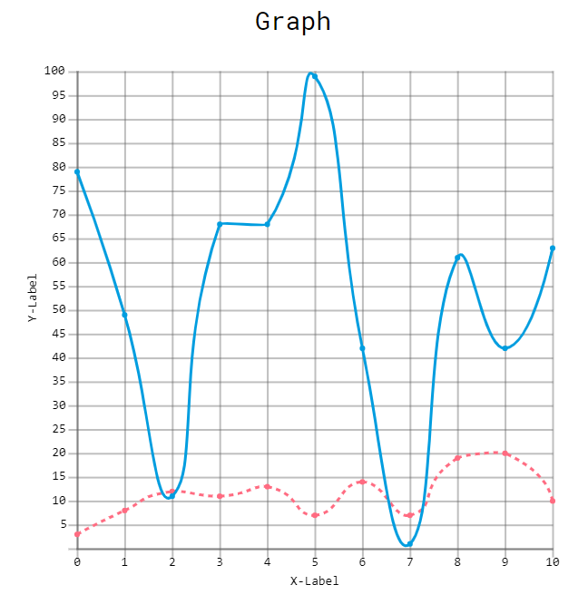
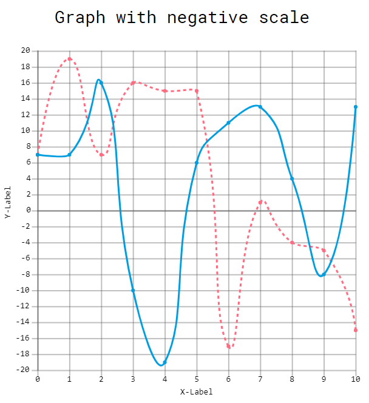

#Basic graphs

##Creating a simple graph with some data sets:

```javascript
 let graph = new Graph('g', {
            x_label: 'X-Label',
            y_label: 'Y-Label',
            title_pos: 'top-center',
            gridOptions: {
                gridded: true,
                sharedAxisZero: true // Share zero between x & y axis' if applicable.
                // for more options check the API docs
            },   
        },
        [
            {
                style: "dashed",
                label: 'student_1',
                interpolation: 'cubic',
                data: getRandomArray(11, 0, 20),
                colour: Graph.Colours.FLAMINGO_PINK
                // for more options check the API docs
            },
            {
                label: 'student_1',
                interpolation: 'cubic',
                data: getRandomArray(11, 0, 100),
                colour: Graph.Colours.ELECTRIC_BLUE
            }
        ]
    );
    graph.draw();
```

Result:




The library also supports data sets which include negative numbers:

```javascript
 let graph = new Graph("graph", {
            x_label: "X-Label",
            y_label: "Y-Label",
            title_pos: "top-center",
            title: "Graph with negative scale",
            gridOptions: {
                gridded: true,
            },
        },
        [
            {
                style: "dashed",
                label: "student_1",
                interpolation: "cubic",
                data: getRandomArray(11, -20, 20),
                colour: Graph.Colours.FLAMINGO_PINK
            },
            {
                label: "student_2",
                interpolation: "cubic",
                data: getRandomArray(11, -20, 20),
                colour: Graph.Colours.ELECTRIC_BLUE
            }
        ]
    );
    graph.draw();
```

Result:


